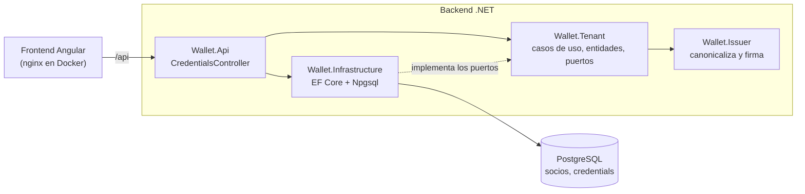
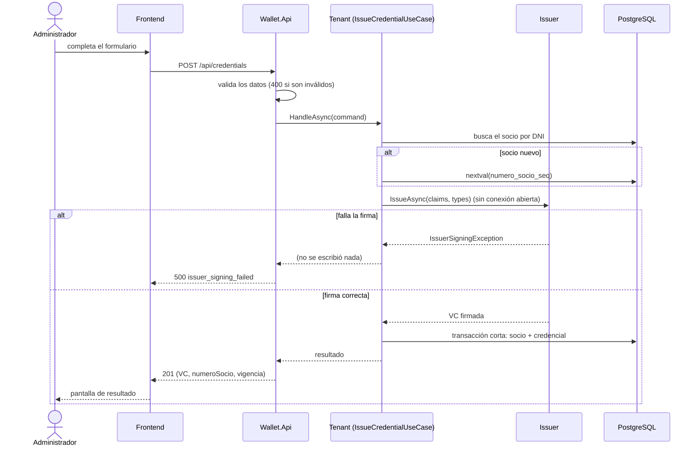
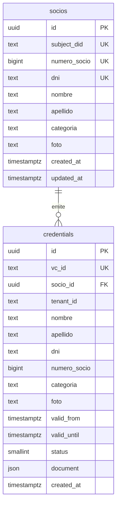

# Arquitectura

## Visión general

- **Tenant** (negocio del club): arma el `credentialSubject`, gestiona socios y persiste.
- **Issuer** (emisión): agrega `id`, `type`, `issuer`, `validFrom`, `validUntil` y `proof`. No conoce la persistencia ni el negocio.

Detalle de la estructura y de las dependencias entre proyectos: [ADR 001](adr/001-estructura-de-la-solucion.md).



Referencias entre proyectos: `Issuer` no referencia a nadie; `Tenant` → `Issuer`; `Infrastructure` → `Tenant`; `Api` → todos.

## Flujo de alta (UC01)

1. La UI envía `POST /api/credentials` con nombre, apellido, DNI, categoría y foto.
2. La API valida (ADR 007 y 017).
3. Tenant normaliza el DNI y busca el socio:
   - si no existe, toma `numeroSocio` de la secuencia y genera `credentialSubject.id` (`did:example:{Guid}`);
   - si existe, reutiliza ambos (ADR 006).
4. Tenant arma el `credentialSubject` y llama al Issuer, **sin conexión abierta a la base**.
5. Issuer canonicaliza (ADR 004 y 012), firma y devuelve la VC.
   - Si falla, se responde un error y **no se persiste nada**.
6. Transacción corta: se guarda o actualiza el socio, se inserta la credencial y se hace commit (ADR 003).
   - Si otra alta insertó el mismo DNI en el medio, el caso de uso repite el flujo una vez con los datos del ganador (ADR 015).
7. La API responde 201 con la VC, el número de socio, la vigencia y si el socio es nuevo (ADR 016).



## Listado (UC02)

`GET /api/credentials?dni=&numeroSocio=`: lee solo `credentials` (snapshot desnormalizado), filtrado por tenant y, opcionalmente, por socio, de lo más nuevo a lo más viejo. Sin credenciales devuelve una lista vacía y la UI muestra el estado vacío.

## Modelo de datos

Ver [ADR 002](adr/002-persistencia.md).



`socios` guarda el estado actual del socio; `credentials`, un snapshot inmutable de lo emitido (con la VC completa en `document`, columna `json`) y el estado actual de la credencial en `status`.

## Modelo de la credencial (VC)

Ejemplo de una VC emitida por el sistema (es el `credential` de la respuesta del alta):

```json
{
  "credentialStatus": 0,
  "credentialSubject": {
    "apellido": "Pérez",
    "categoria": "niño",
    "dni": "30123456",
    "foto": "https://cdn.futbol.com.ar/socios/8f14e45f.jpg",
    "id": "did:example:63739d15-663d-4557-831f-5c252c100f12",
    "nombre": "Juan",
    "numeroSocio": "000001"
  },
  "id": "https://credenciales.futbol.com.ar/8f90cd4b-661a-429d-be9a-10217804751a",
  "issuer": "did:example:futbol",
  "type": ["VerifiableCredential", "SocioCredential"],
  "validFrom": "2026-09-30T07:58:54Z",
  "validUntil": "2027-09-30T07:58:54Z",
  "proof": {
    "type": "HMAC-SHA256",
    "created": "2026-09-30T07:58:54Z",
    "verificationMethod": "did:example:futbol#key-1",
    "proofValue": "YwE/Nmou7VOt1xjzQBgqi1KhfUYdAsFOb1nXYPue7tU="
  }
}
```

`proofValue` es el HMAC-SHA256, en base64, del mismo documento sin `proof` (JSON compacto, con el orden de claves del enunciado); un test de integración lo recalcula sobre lo que devuelve la API.

## Decisiones

El índice de decisiones está en [`docs/adr/`](adr/). Las de este documento: 001 (estructura), 002 (persistencia), 003 (flujo y resiliencia), 004/012 (canonicalización y contrato del Issuer), 006 (identidad del socio), 007 (errores), 015 (Tenant), 016 (contrato HTTP) y 017 (Infrastructure y Api).
